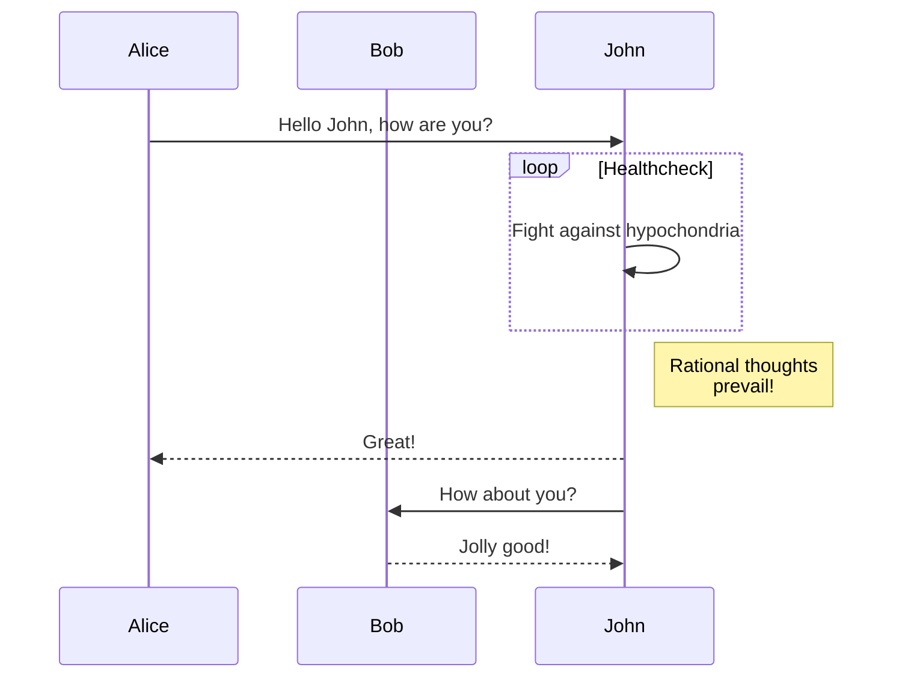

[](https://github.com/seanmcguigan/poker-app/actions/workflows/pre-prod.yaml)
[](https://github.com/seanmcguigan/poker-app/actions/workflows/prod-release.yaml)
[](https://github.com/seanmcguigan/poker-app/actions/workflows/confirm-deployment.yaml)


## poker-app

#### tag for release - v1.0.0

#### commit messages vs what they do

| Commit message                                                                         | Tag increase |
| -------------------------------------------------------------------------------------- | ------------ |
| `fix: fixed something`                                                                 | Patch        |
| `feat: added new button to do X`                                                       | Minor        |
| `fix: fixed thing xyz`<br><br>`BREAKING CHANGE: this will break users because of blah` | Major        |
| `fix!: fixed something`                                                                | Major        |
| `feat!: added blah`                                                                    | Major        |
| `chore: foo`                                                                           | Nothing      |

```date > ./src/date && docker build -t docker.io/seanmcguigan/poker:foobar . -f Docker/Dockerfile```


